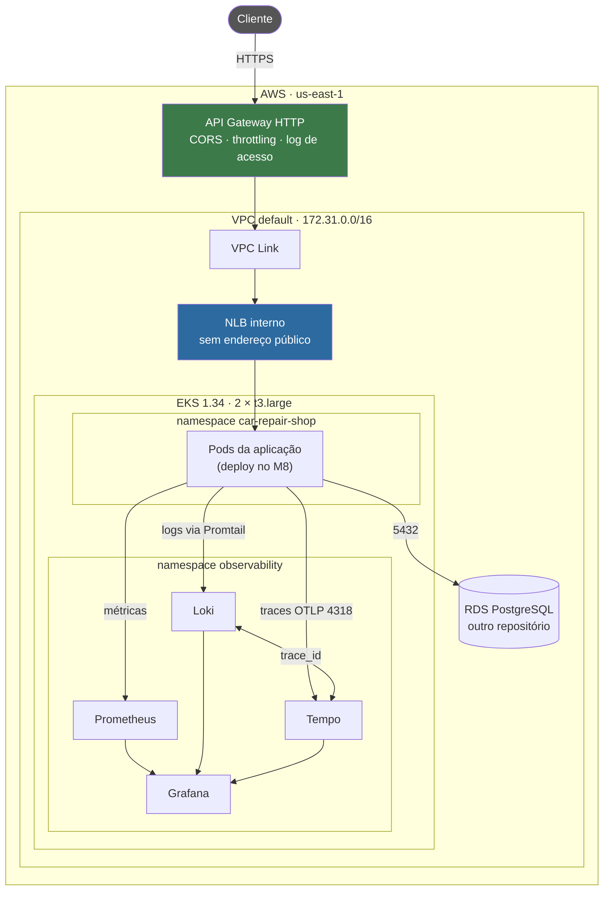

# Infraestrutura Kubernetes — Tech Challenge Fase 3

Provisiona o **cluster EKS**, a **stack de observabilidade** e o **API Gateway** que é a porta de
entrada de todo o sistema.

---

## Para que serve

A aplicação da oficina roda em contêineres e precisa de um lugar para rodar, de um caminho de entrada
controlado e de instrumentação que mostre o que está acontecendo. Este repositório entrega os três.

| O que provisiona | Para quê |
|---|---|
| Cluster EKS e node group | onde a aplicação roda |
| Addons (CNI, CoreDNS, metrics-server, EBS CSI) | rede, DNS, HPA e volumes |
| AWS Load Balancer Controller e NLB interno | expõe a aplicação **dentro** da VPC |
| Prometheus, Grafana, Alertmanager | métricas |
| Loki e Promtail | logs |
| Tempo | tracing distribuído |
| API Gateway e VPC Link | ponto único de entrada, com throttling |

## O que este repositório **não** faz

- **não cria VPC** — consome a default da região
- **não cria o banco** — isso é do repositório de infraestrutura do banco, cujo estado é lido aqui
- **não cria role de IAM** — o Learner Lab restringe; cluster e nós assumem a `LabRole` existente
- **não faz o deploy da aplicação** — os pods vêm do repositório da aplicação. O **Service** mora
  aqui, porque é ele que faz nascer o NLB de que o gateway depende

---

## Arquitetura



**O caminho de entrada é único.** O NLB é interno e não tem endereço público: a única forma de
alcançar a aplicação de fora é pelo API Gateway, que aplica throttling e CORS. Um NLB público criaria
um caminho paralelo que ignora esses controles — e ninguém saberia que ele existe.

A seta de ida e volta entre Loki e Tempo é a correlação: de um log lento se chega ao trace, e de um
span se chega às linhas de log daquela requisição.

---

## Tecnologias

| Ferramenta | Versão | Para quê |
|---|---|---|
| Terraform | >= 1.10 | provisionamento |
| Provider AWS | ~> 5.0 | cluster, rede, gateway |
| Provider Helm | ~> 2.17 | observabilidade e controller |
| Kubernetes (EKS) | **1.34** | orquestração |
| kube-prometheus-stack | 88.6.1 | métricas |
| Loki / Promtail | 7.3.0 / 6.17.1 | logs |
| Tempo | 1.24.4 | tracing |
| tflint / trivy | 0.64 / 0.74 | análise estática |

**A versão do Kubernetes não é escolha estética.** A AWS move versões antigas para *suporte
estendido*, cobrado a **USD 0,60/hora** contra **USD 0,10/hora** do padrão — seis vezes mais pelo
mesmo cluster. Conferir antes de mudar:

```bash
aws eks describe-cluster-versions \
  --query 'clusterVersions[].[clusterVersion,versionStatus]' --output table
```

---

## Pré-requisitos

### 1. Credencial do Learner Lab

**Start Lab**, esperar a bolinha verde, **AWS Details → AWS CLI → Show**, colar em
`~/.aws/credentials`.

> A credencial expira em ~4h **e é revogada quando a sessão do lab para**. O sintoma da revogação é
> uma negação explícita citando a policy `voc-cancel-cred` — nesse caso o `sts get-caller-identity`
> ainda responde, mas nenhuma operação real passa.

### 2. O repositório do banco aplicado

Este repositório lê o estado do banco. Sem ele aplicado, o `terraform apply` falha ao resolver os
outputs. Conferir:

```bash
echo 'data.terraform_remote_state.db.outputs.db_endpoint' | terraform console
```

### 3. Bucket de estado

O mesmo do repositório do banco, com a chave `infra-k8s/terraform.tfstate`. A criação está
documentada lá.

---

## Execução local

Em repositório de infraestrutura, "rodar local" é executar o Terraform da sua máquina contra a AWS.

```bash
terraform init
terraform plan          # leia antes de aplicar
terraform apply         # cluster leva 10-15min, node group outros 5-10
```

Antes de abrir PR, o mesmo ciclo do CI:

```bash
terraform fmt -recursive
terraform validate
python3 scripts/check-no-public-ingress.py
tflint --init && tflint
trivy config --severity HIGH,CRITICAL .
```

### Acessar o cluster

```bash
aws eks update-kubeconfig --name car-repair-shop --region us-east-1
kubectl get nodes
```

### Acessar o Grafana

`ClusterIP` de propósito — expor criaria um segundo caminho de entrada, fora do gateway.

```bash
kubectl port-forward -n observability svc/kube-prometheus-stack-grafana 3000:80

# usuario: admin
kubectl get secret -n observability grafana-admin \
  -o jsonpath='{.data.admin-password}' | base64 -d
```

---

## Dashboards e alertas

**Versionados como código, em `dashboards/*.json`.** Painel montado pela UI se perde quando o
cluster é destruído — e aqui o cluster é destruído por construção. Um `fileset` gera um ConfigMap
por arquivo, com o label `grafana_dashboard = "1"`; o sidecar do Grafana varre esse label e carrega
sozinho. Não há passo manual de importação.

| Dashboard | Conteúdo |
|---|---|
| Volume de ordens de serviço | Contagem, taxa de abertura, distribuição diária |
| Tempo até cada status | p50, p95, média e heatmap por transição |
| Latência, healthchecks e uptime | p50/p95/p99 por rota, RPS, taxa de erro 5xx, uptime |
| Recursos do Kubernetes | CPU e memória contra requests e limites, réplicas contra o HPA |

As quatro regras de alerta e o `PodMonitor` da aplicação são **valores do chart**, no `metrics.tf`,
e não `kubernetes_manifest`. O motivo é de ordem: os CRDs `PodMonitor` e `PrometheusRule` só
existem depois que o `kube-prometheus-stack` é aplicado, e um `kubernetes_manifest` exige o CRD já
presente no `plan`. Numa subida do zero isso falha antes de criar qualquer coisa.

| Alerta | Condição | Severidade |
|---|---|---|
| `ServiceOrderProcessingFailures` | falhas de integração no processamento | crítico |
| `ApplicationDown` | nenhum alvo respondendo ao scrape | crítico |
| `HighErrorRate` | mais de 5% de 5xx | crítico |
| `HighApiLatency` | p95 acima de 1s | aviso |

Duas expressões merecem atenção, porque a versão ingênua **não dispara**:

- `ApplicationDown` usa `(sum(up{...}) or vector(0)) == 0`. Com `up == 0` puro, se os pods somem a
  série deixa de existir, e expressão sobre série ausente não produz resultado — o alerta ficaria
  em silêncio justamente quando deveria gritar.
- A taxa de erro usa `or vector(0)` no numerador pelo mesmo motivo: sem nenhum 5xx, o painel
  mostraria `No data` em vez de `0%`, indistinguível de painel quebrado.

O `for` do `ServiceOrderProcessingFailures` está em 1 minuto, encurtado para a demonstração;
produção pediria 5. Está anotado na própria regra.

---

## Deploy

| Evento | O que roda |
|---|---|
| PR | fmt, validate, ingress fechado, tflint, trivy, e o plano comentado no PR |
| Merge na `main` | apply, e depois **verifica**: cluster `ACTIVE`, nós `Ready`, observabilidade de pé |
| Botão **Destroy** | remove Services de LoadBalancer, destrói, confere a conta |

Renovar os secrets quando a credencial cair:

```bash
./scripts/refresh-aws-secrets.sh
```

A validação **não** depende de credencial: quando a chave do lab cai, a revisão perde o plano mas
mantém o portão.

---

## Runbook

### Subir

```bash
terraform init && terraform apply
```

Cerca de 25 minutos no total, com o VPC Link sendo o recurso mais lento.

### Ver o que está custando

```bash
./scripts/status.sh
```

### Derrubar

```bash
./scripts/teardown.sh            # destroy e confere o que sobrou
./scripts/teardown.sh --sweep    # remove também o que o estado não alcançou
```

O sweep remove **node group antes do cluster**. Essa ordem não é detalhe: o cluster recusa a remoção
com node group ativo, e os nós continuam cobrando EC2 enquanto isso.

### Diagnóstico rápido

```bash
kubectl get nodes
kubectl get pods -A | grep -v Running
kubectl top nodes
kubectl describe nodes | grep -A8 "Allocated resources"
```

---

## Custo

**Este é o repositório caro da fase.**

| Recurso | Por dia |
|---|---|
| EKS control plane (suporte padrão) | USD 2,40 |
| 2 × t3.large | USD 4,00 |
| NLB interno | USD 0,54 |
| Chave KMS | USD 0,03 |
| **Total** | **~USD 4,97** |

Somado ao banco (USD 0,51/dia), a stack completa fica em **~USD 5,50/dia**. Com o orçamento de
USD 50 do Learner Lab, isso dá **cerca de 9 dias** de execução contínua.

**Derrubar entre sessões de trabalho é o que faz o orçamento durar a fase inteira.** Recriar leva ~25
minutos.

---

## Dimensionamento, e por que `t3.large`

O limite que apertou primeiro **não foi memória, foi vaga de pod**. O teto por nó vem do número de
ENIs do tipo da instância:

| Tipo | ENIs × IPs | Teto de pods | RAM |
|---|---|---|---|
| t3.medium | 3 × 6 | 17 | 4 GiB |
| **t3.large** | 3 × 12 | **35** | 8 GiB |

Com dois `t3.medium` o cluster tinha 34 vagas, e só a infraestrutura ocupou 25 — um nó chegou a
17/17 e o `loki-0` mais um `promtail` ficaram `Pending` **por falta de vaga, não de recurso**.

Medido depois da troca:

```
ip-172-31-4-24     8/35 pods   6.91 GiB
ip-172-31-81-245  16/35 pods   6.91 GiB
--> teto 70 pods, 13.83 GiB alocaveis
```

Cinco dos pods de infraestrutura são DaemonSet, um por nó. Por isso nó maior **reduz** a contagem
total, além de aumentar o teto — foi o argumento que decidiu entre subir o tipo da instância e
ativar prefix delegation na CNI. A segunda opção seria gratuita, mas manteria 25 pods para rodar um
serviço simples, e acrescentaria um ajuste não óbvio para manter.


---

## Restrições do Learner Lab que moldaram este código

Não são detalhes de implementação: elas invalidam a maior parte dos exemplos de EKS da internet.

| Restrição | Consequência |
|---|---|
| Não é possível criar role de IAM | cluster e nós assumem a `LabRole`; exemplos que criam roles dedicadas não funcionam |
| **Não há IRSA** | sem provedor OIDC nem trust policy editável, o EBS CSI e o Load Balancer Controller usam a credencial da instância |
| Hop limit do IMDS vem em 1 | um launch template sobe para 2; sem isso, todo pod que chama a API da AWS falha com `no EC2 IMDS role found` |
| Subnets da VPC default sem tag | o Load Balancer Controller não acha onde pôr o NLB; as tags são criadas por `aws_ec2_tag` |

---

## Repositórios relacionados

| Repositório | Papel |
|---|---|
| [fiap-tech-challenge](https://github.com/diandria/fiap-tech-challenge) | a aplicação que roda neste cluster |
| [fiap-tech-challenge-infra-db](https://github.com/diandria/fiap-tech-challenge-infra-db) | o banco que a aplicação consome |
| [fiap-tech-challenge-lambda](https://github.com/diandria/fiap-tech-challenge-lambda) | as functions; o gateway daqui roteia `POST /auth/cpf` para a `auth`, e lê o ARN dela do estado remoto de lá |

A relação com a aplicação é direta: os endpoints publicados aqui alimentam a configuração dela.
`tempo_otlp_http_endpoint` vira `OTEL_EXPORTER_OTLP_ENDPOINT`, e `db_endpoint`, `db_port`,
`db_name` e `db_password_parameter` são repassados do estado do banco para montar a conexão.

A documentação da API — **Swagger** em `/docs` e a coleção do **Postman** em `postman/` —
descreve os endpoints que o API Gateway roteia para os pods deste cluster.
